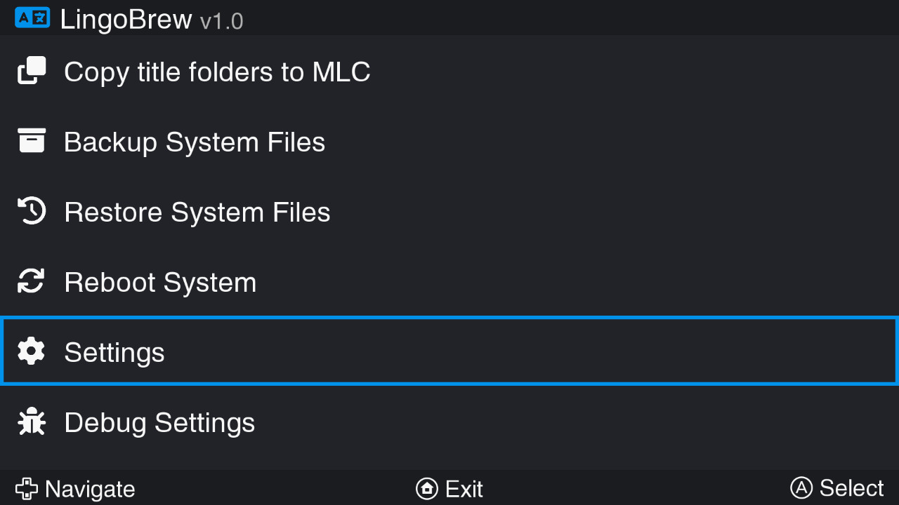
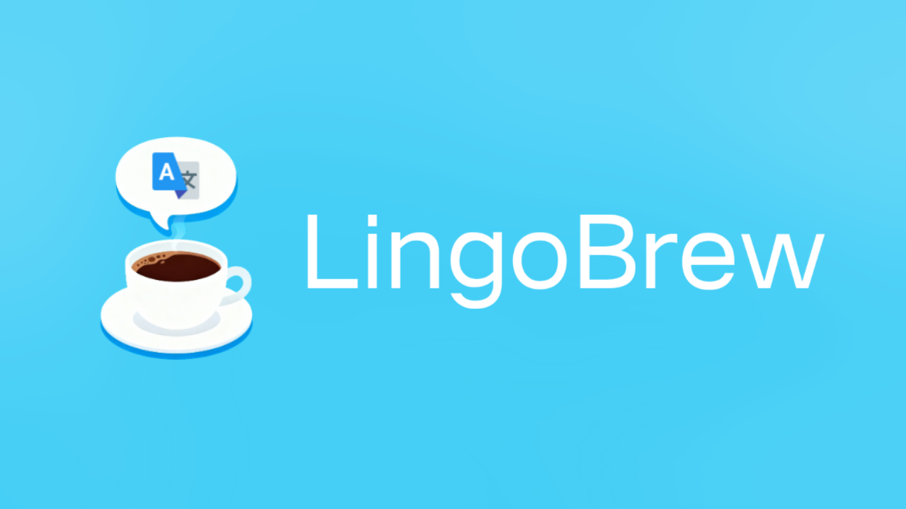
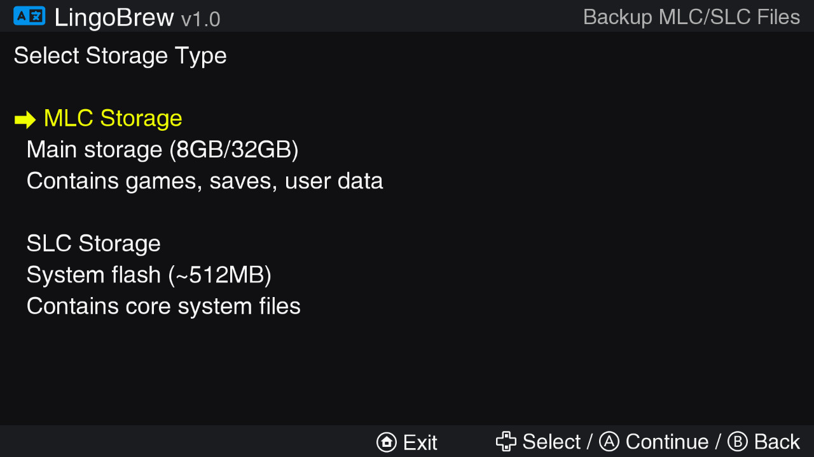
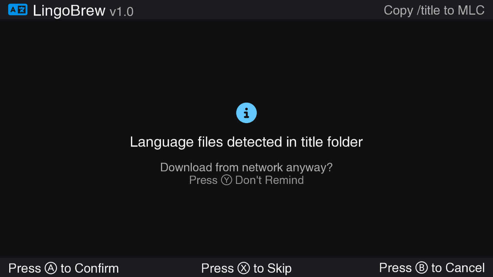
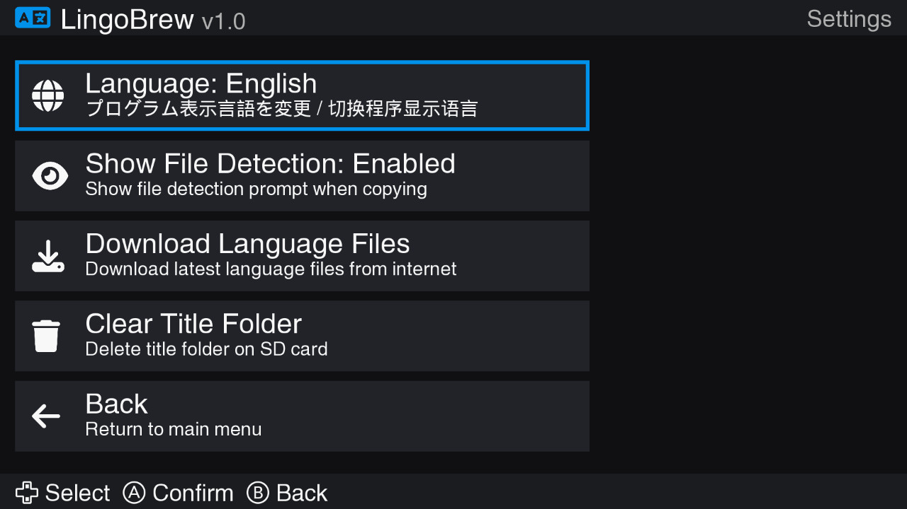
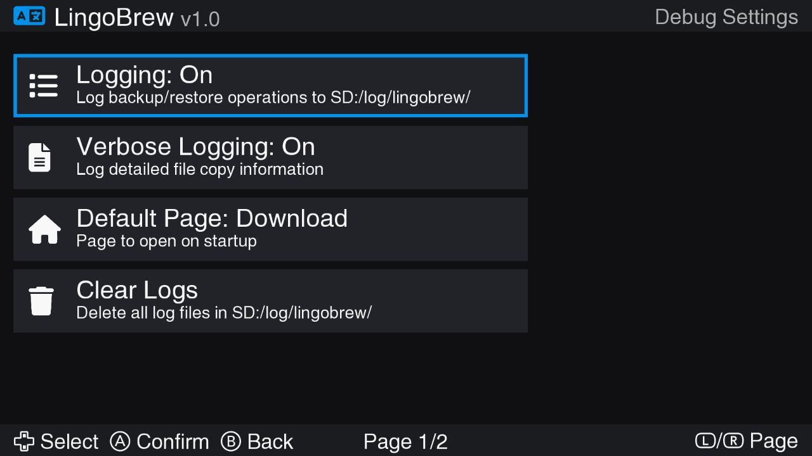

#  LingoBrew - Brew Your System's Language

A multilingual Wii U homebrew application for switching system language files. Say goodbye to FTP servers!

[](LICENSE)
[](https://github.com/wiiu-env)
[](#features)

Based on [@YveltalGriffin's](https://github.com/mackieks) haxcopy.

> LingoBrew requires the [MochaPayload](https://github.com/wiiu-env/MochaPayload)!                
> Make sure to update to [Aroma](https://aroma.foryour.cafe) or [Tiramisu](https://tiramisu.foryour.cafe) before using this application.

---

## Features

- Full support for 3 languages: 中文 / English / 日本語

- Full Backup: Complete MLC system backup before language switch
- Selective Backup: Only backs up files that will be overwritten by SD card contentg

- Download language files from internet
- Copy language files from SD card (`fs:/vol/external01/title`) to MLC (`mlc:/sys/title`)
- Option to copy font files for enhanced character support
- Selective font backup to preserve existing system fonts

- Restore from previous backups
- Support for MLC, SLC, SLCCMPT backups
- Separate management for system, user, and title data
- Safe restore with confirmation prompts


### Download
1. Download the latest `LingoBrew` from [Releases](https://github.com/xziip/LingoBrew/releases)
2. Place it in `sd:/wiiu/apps/` directory
3. Launch from Wii U Menu via Aroma/Tiramisu (.wuhb can only be launched from Aroma)

### Language Files Setup 

## (Download language files from [here](https://github.com/xziip/wiiu-lang-files/releases) )

Your SD card should have this structure:
```
sd:/vol/external01/title/
├── 00050000/
│   ├── XXXXXXXX/    (Title ID folders)
│   └── ...
├── 00050002/
└── ...
```
### Font Files (Optional)
For enhanced Japanese/Chinese character support:
```
sd:/wiiu/fonts/
└── CafeStd.ttf (Your font file)
```

### Settings
- **Language**: Switch between 中文/English/日本語
- Real-time UI updates without restart


### DebugScreen
- Press "L"  "+" "-" to open debugscreen 

## Screenshots

### Main Menu and Loading creen
  

### Backup Screen and Copyscreen
  

### Settings screen and Debugscreen
  

## Building
For building you need: 
- [wut](https://github.com/devkitPro/wut)
- [libmocha](https://github.com/wiiu-env/libmocha)
- [wiiu-sdl2](https://github.com/GaryOderNichts/SDL/tree/wiiu-sdl2-2.26)
- wiiu-sdl2_ttf
- wiiu-curl
- wiiu-mbedtls

You can also build LingoBrew using docker:
```bash
# Build docker image (only needed once)
docker build . -t lingobrew_builder

# make 
docker run -it --rm -v ${PWD}:/project lingobrew_builder make

# make clean
docker run -it --rm -v ${PWD}:/project lingobrew_builder make clean
```

## Format the code via docker

`docker run --rm -v ${PWD}:/src ghcr.io/wiiu-env/clang-format:13.0.0-2 -r ./source -i`

## Additional Credits
- [Maschell](https://github.com/Maschell) for creating [WiiUCrashLogDumper](https://github.com/wiiu-env/WiiUCrashLogDumper). The app is based on WiiUCrashLogDumper.
- [GaryOderNichts](https://github.com/GaryOderNichts) for creating [WiiUIdent](https://github.com/GaryOderNichts/WiiUIdent). The GUI is based on WiiUIdent.
- [YveltalGriffin](https://github.com/mackieks) for creating [haxcopy](https://github.com/mackieks/haxcopy). The app is also based on haxcopy.
- [FontAwesome](https://fontawesome.com/) for the icons.
- [Terminus Font](https://terminus-font.sourceforge.net/) for the monospace font.
